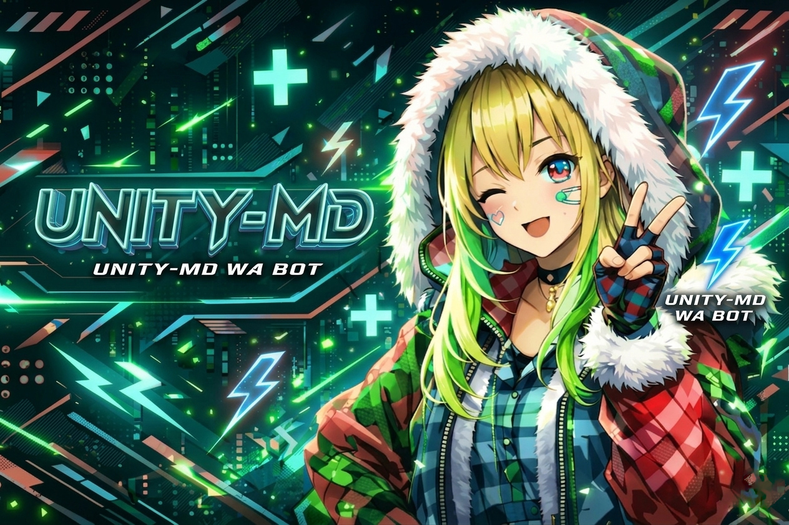

<div align="center">

# 🧲 ❮❮ UNITY-MD ❯❯ 🧩

### ® UNITY TEAM

[](https://nodejs.org)
[](https://mongodb.com)
[](https://github.com/whiskeysockets/baileys)
[](LICENSE)
[](README.md)
[](https://render.com)



> **WhatsApp MD Bot — Built for UNITY TEAM**
> 350+ commands | MongoDB | Dashboard | Sri Lanka focused

</div>

## ✨ Features

<table>
<tr>
<td>

### 🤖 AI
- Gemini Pro chat
- Conversation memory
- Group AI mode

### ⬇️ Downloads
- YouTube MP3/MP4
- TikTok, Instagram
- Facebook, Cinesubz
- MediaFire

### 👥 Group Tools
- Full admin control
- Anti-hijack system
- Protection suite
- Keyword auto-reply

</td>
<td>

### 🛡️ Protection
- Anti-spam/link/toxic
- Anti-raid & flood
- Anti-delete reveal
- Captcha on join

### 📲 Channel System
- 3-channel architecture
- Auto follow/react/view
- Silent boost system
- Channel manager

### 🇱🇰 Sri Lanka
- Cinesubz movies
- Ada Derana news
- Sinhala lyrics
- Local weather

</td>
<td>

### 🎮 Games
- Tic-tac-toe (AI)
- Blackjack
- Truth or Dare
- Slots & Riddles

### 🌐 Dashboard
- Web control panel
- Real-time stats
- Group manager
- Broadcast panel

### 🔐 Security
- AES-256 config
- Rate limiting
- Audit logs
- Session encryption

</td>
</tr>
</table>

---

## 🔐 Permission Levels

| Level | Who | Commands |
|-------|-----|----------|
| 👤 Everyone | Any group user | ~95 commands |
| 📱 Paired | JadiBot users | +30 commands |
| 👑 Admin | Group admins | +38 commands |
| 🔐 Owner | You only | +30 commands |

---

## 📲 Channel System

| Channel | Purpose | Access |
|---------|---------|--------|
| 📢 Channel 1 | Public updates | Everyone |
| 🔕 Channel 2 | Silent boost hub | Auto-follow |
| 🔐 Channel 3 | Owner dashboard | Private |

---

## ⚡ Quick Start

```bash
git clone https://github.com/Podda2006/UNITY-md
cd UNITY-md
npm install
# Fill config.env
node start.js
```

---

## 🚀 Deploy on Render

```
1. New Web Service → Connect GitHub repo
2. Language: Docker
3. Region: Singapore
4. Add Environment Variables
5. Deploy!
```

---

## ⚙️ Environment Variables

| Key | Required | Description |
|-----|----------|-------------|
| `OWNER_NUMBER` | ✅ | Your WA number (94xxxxxxxxx) |
| `MONGODB_URI` | ✅ | MongoDB Atlas URI |
| `GEMINI_API_KEY` | ✅ | Google AI Studio key |
| `DASHBOARD_PASSWORD` | ✅ | Dashboard login password |
| `DASHBOARD_SECRET` | ✅ | Session secret string |
| `CHANNEL_JID_1` | ⏳ | Public channel JID |
| `CHANNEL_JID_2` | ⏳ | Boost channel JID |
| `CHANNEL_JID_3` | ⏳ | Owner dashboard JID |

---

## 📦 Commands

<details>
<summary>🤖 AI (5 commands)</summary>

| Command | Description |
|---------|-------------|
| .ai / .gemini | Chat with Gemini AI |
| .clearai | Clear AI memory |
| .resetai | Reset conversation |
| .stopai | Stop AI in chat |

</details>

<details>
<summary>⬇️ Downloaders (18 commands)</summary>

| Command | Description |
|---------|-------------|
| .ytmp3 | YouTube audio |
| .ytmp4 | YouTube video |
| .ytsearch | Search YouTube |
| .tiktok / .ttmp3 | TikTok video/audio |
| .ig / .igdl | Instagram media |
| .fb / .fbdl | Facebook video |
| .movie / .cinesubz | SL movies |
| .mf | MediaFire file |

</details>

<details>
<summary>👥 Group + Protection (38 commands)</summary>

kick, promote, demote, tagall, open, close, mute, unmute, setdesc, setsubject, rules, setrules, faq, linkgc, revoke, membercount, groupinfo, antilink, antispam, antidelete, anticall, antitoxic, antiforward, antiraid, slowmode, captcha, badwords, setkeyword...

</details>

<details>
<summary>🛠️ Tools (20 commands)</summary>

tts, tr, qr, ping, calc, bmi, age, pass, sticker, toimg, morse, binary, mirror, zalgo, glitch, fancy, pdf, tovn, uppercase, lowercase...

</details>

<details>
<summary>🎮 Games (5 commands)</summary>

ttt (Tic-tac-toe with AI), blackjack, truth, dare, slots, riddle

</details>

<details>
<summary>🇱🇰 Sri Lanka (12 commands)</summary>

movie, cinesubz, weather, news, esana, cricket, define, sinhalafont, sinhalalyrics, holiday, cinema, dictionary

</details>

---

## 📄 License

```
© 2025 UNITY TEAM. All rights reserved.
Redistribution prohibited without permission.
```

---

<div align="center">

**🧲 ❮❮ UNITY-MD ❯❯ 🧩**

*Built with ❤️ by UNITY TEAM*

</div>